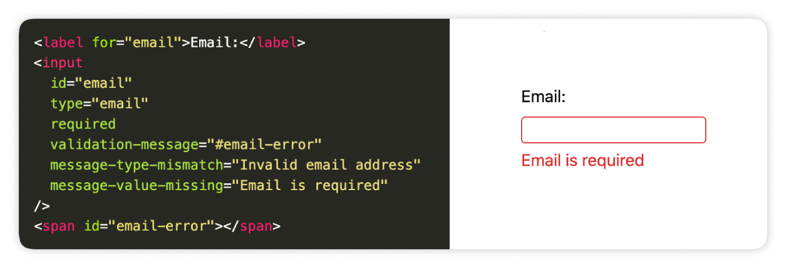

<div style="text-align:center;">
<h1>input-validity</h1>



</div>

Minimal [(702 B min+gzip)](https://bundlephobia.com/package/input-validity@0.1.4) client-side form validation library with 0 dependencies that uses [native HTML5 validation](https://developer.mozilla.org/en-US/docs/Web/HTML/Constraint_validation). Works perfect with server-rendered apps and minimal frontend libraries such as [HTMX](https://htmx.org/) or [Alpine.js](https://alpinejs.dev/).

Docs: [https://input-validity.pages.dev/](https://input-validity.pages.dev/)

## How it works

In essence it allows for custom styling of HTML validation and aligns behaviour attributes like `required`, `type="email"`, `min`, `maxlength`, etc. to behave more like modern frontend framework validation.

Under the hood `input-validity` does following:

1. Adds `data-dirty` to a `<input />` or element, which combined with `:invalid` CSS pseudo class allows for indicating error state of the input. This attribute is added to the input after first `invalid` event (fired after first submit attempt).
2. Displays native error message in any DOM element specified with `validation-message` attribute. Falls back to native popover if not specified.
3. Allows for custom error messages with `message-*` attributes. Falls back to native messages if not specified.

## Examples and usage

[See examples here.](https://input-validity.pages.dev/)

## Installing

Installing `input-validity` is as simple as adding a `<script>` tag to your page. No need for complicated build steps or systems.

### via CDN, for example [unpkg](https://www.unpkg.com/)

```html
<script src="https://www.unpkg.com/input-validity"></script>
```

or with specific version:

```html
<script src="https://www.unpkg.com/input-validity@0.1.4"></script>
```

CDN approach is extremely simple but you may want to consider [not using CDNs in production](https://blog.wesleyac.com/posts/why-not-javascript-cdn).

### Download a copy

[Download](https://www.unpkg.com/input-validity@0.1.4/dist/iife/index.js) and copy it into your project to a public assets directory

```html
<script src="/path/to/input-validity.js"></script>
```

### NPM and bundlers

If you prefer you can also install with `npm` / `pnpm` / `yarn`:

```
npm install input-validity
```

And then import into your code:

```js
import "input-validity";
```

Currently only ESM is supported.

## API

Following attributes can be used on any `<input />` element.

### Attributes for specifying behaviour:

| Attribute          | Value                                                           |
| ------------------ | --------------------------------------------------------------- |
| validation-message | CSS selector specifying where error message should be displayed |

### Attributes for defining custom error messges:

| Attribute                | Description                                                                                                                                                                                        | Corresponding ValidityState property                                                              |
| ------------------------ | -------------------------------------------------------------------------------------------------------------------------------------------------------------------------------------------------- | ------------------------------------------------------------------------------------------------- |
| message-bad-input        | Input value that the browser is unable to convert                                                                                                                                                  | [badInput](https://developer.mozilla.org/en-US/docs/Web/API/ValidityState/badInput)               |
| message-pattern-mismatch | Input value does not match the specified [pattern](https://developer.mozilla.org/en-US/docs/Web/HTML/Element/input#pattern)                                                                        | [patternMismatch](https://developer.mozilla.org/en-US/docs/Web/API/ValidityState/patternMismatch) |
| message-range-overflow   | Input value is greater than the maximum specified by the [max](https://developer.mozilla.org/en-US/docs/Web/HTML/Element/input#max) attribute                                                      | [rangeOverflow](https://developer.mozilla.org/en-US/docs/Web/API/ValidityState/rangeOverflow)     |
| message-range-underflow  | Input value is less than the minimum specified by the [min](https://developer.mozilla.org/en-US/docs/Web/HTML/Element/input#min) attribute                                                         | [rangeUnderflow](https://developer.mozilla.org/en-US/docs/Web/API/ValidityState/rangeUnderflow)   |
| message-step-mismatch    | Input value does not fit the rules determined by the [step](https://developer.mozilla.org/en-US/docs/Web/HTML/Element/input#step) attribute (that is, it's not evenly divisible by the step value) | [stepMismatch](https://developer.mozilla.org/en-US/docs/Web/API/ValidityState/stepMismatch)       |
| message-too-long         | Input value exceeds the specified `maxlength`                                                                                                                                                      | [tooLong](https://developer.mozilla.org/en-US/docs/Web/API/ValidityState/tooLong)                 |
| message-too-short        | Input value fails to meet the specified `minlength`                                                                                                                                                | [tooShort](https://developer.mozilla.org/en-US/docs/Web/API/ValidityState/tooShort)               |
| message-type-mismatch    | Input value is not in the required syntax (when [type](https://developer.mozilla.org/en-US/docs/Web/HTML/Element/input#type) is `email` or `url`)                                                  | [typeMismatch](https://developer.mozilla.org/en-US/docs/Web/API/ValidityState/typeMismatch)       |
| message-value-missing    | Input element has a [required](https://developer.mozilla.org/en-US/docs/Web/HTML/Element/input#required) attribute, but no value                                                                   | [valueMissing](https://developer.mozilla.org/en-US/docs/Web/API/ValidityState/valueMissing)       |

## Browser support

`input-validity` will work on all browsers that support [ValidityState API](https://caniuse.com/?search=validitystate)

## License

MIT
